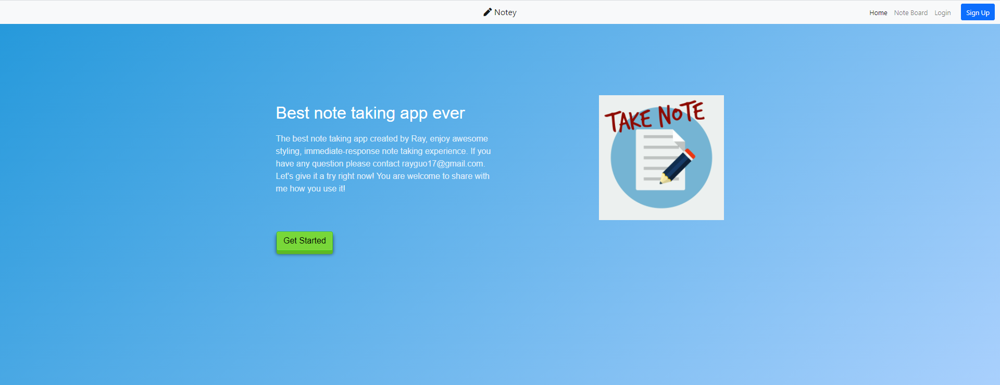
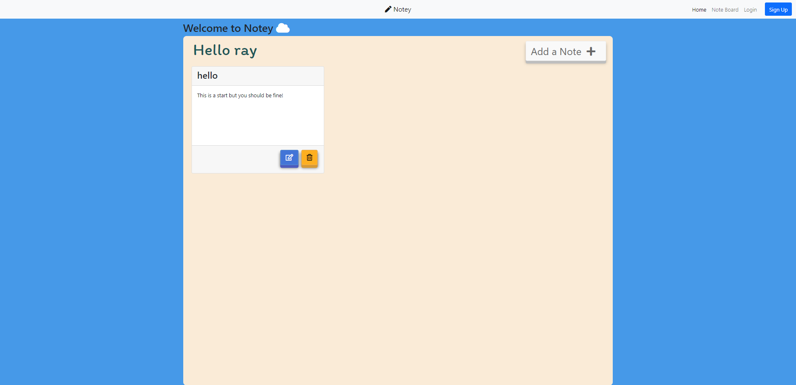

# Note-taking-application

This is a note taking application a.k.a notey, which is build with template engine handlebars, using node.js as backend, integrated express-basic-auth, 
allow user to register and login, seperate backend code into several section including service, router and views.

## home page appearance

## note board appearane

